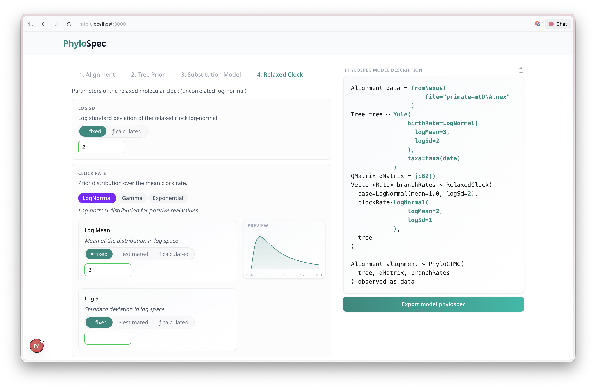

# PhyloSpec Template GUI

A visual form builder for composing [PhyloSpec](../../) model descriptions. Fill in placeholders interactively and export a ready-to-run `.phylospec` file.

> **POC only.** Built with Claude Code as a proof-of-concept — not production-ready.



---

## Features

- **Template-driven UI** — define a PhyloSpec template with `$placeholder` tokens; the GUI renders one tab per placeholder (or grouped tabs for related parameters).
- **Type-aware selectors** — each placeholder is typed (`PositiveReal`, `QMatrix`, `Distribution<Tree>`, …). The selector shows only components that produce a value of the correct type.
- **Three assignment modes** — *Fixed* (literal value, `=`), *Estimated* (prior distribution, `~`), and *Calculated* (generator expression, `=`).
- **Live preview** — the resolved PhyloSpec model updates in real time as you fill in values. Unresolved tokens are highlighted; filled-in values are shown in the accent colour.
- **Export** — download the fully-resolved model as `model.phylospec` once all placeholders are filled. Copy-to-clipboard button always available.
- **Extensible component registry** — register new literal types or generator components with a single `register()` call; generator components are auto-registered from `app/core-components.json`. Hand-written specialised components (e.g. `FromNexusGeneratorInput` for file-backed Nexus data, `ScalarDistributionInput` with live density preview) follow the same `register()` API using the `custom.*` id namespace.

---

## Stack

| Layer | Technology |
|---|---|
| Framework | Next.js (App Router) |
| Language | TypeScript |
| Styling | Tailwind CSS v4 |
| Validation | Zod |
| UI components | Custom (no component library) |

---

## Getting Started

```bash
npm install
npm run dev
```

Open [http://localhost:3000](http://localhost:3000).

---

## Documentation

See [`docs/component-system.md`](docs/component-system.md) for a full description of the component model, registry API, TypeSelector behaviour, and how to add new components.
